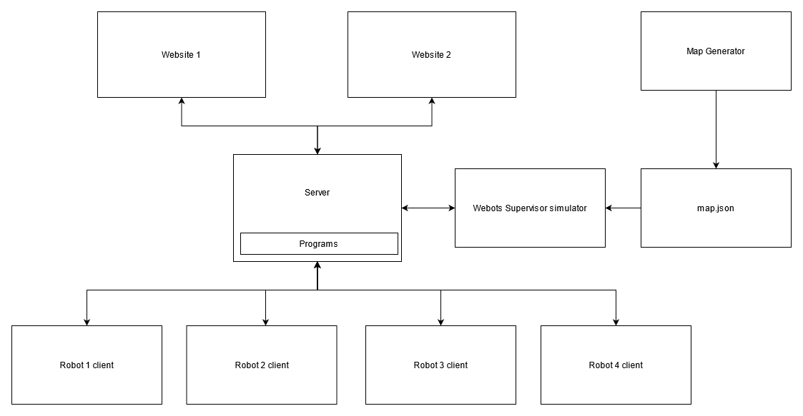
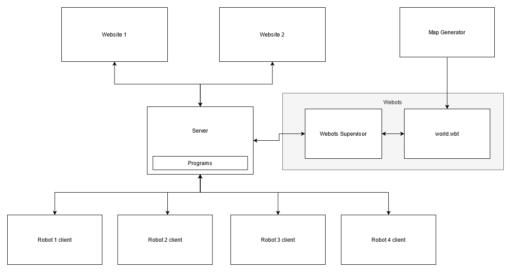

# MegaBots Deluxe!!!
Some mega bots living in a grid

## Run the server and clients:
- Install the websockets Python package:

    ```
    pip install websockets
    ```

- Run the `test.sh` script to start the robots simulation without Webots:

    ```
    ./test.sh
    ```

- Run the `test.sh` script with webots argument to start the robots simulation with / in Webots:

    ```
    ./test.sh webots
    ```

## Communication design without Webots:


## Communication design with Webots:


## Protocol:
All message are encoded in JSON and send over an plain WebSocket connection with the centeral websockets server.

```
**Robot 1 connects**
> robot 1 { robot_connect }

< robot 1 { world_info }
< robot 1 { robot_connect (complete) }
< robot 2 { robot_connect (complete) }
< robot 3 { robot_connect (complete) }
< robot 4 { robot_connect (complete) }

> website { new_direction or cancel_direction }
< robot 1 { new_direction or cancel_direction }
< robot 2 { new_direction or cancel_direction }
< robot 3 { new_direction or cancel_direction }
< robot 4 { new_direction or cancel_direction }

loop {
    < robot 1 { robot_tick }

    > robot 1 { read_sensors }
    < robot 1 { read_sensors_done }

    > robot 1 { robot_tick_done }
    < robot 2 { robot_tick_done }
    < robot 3 { robot_tick_done }
    < robot 4 { robot_tick_done }
}

**Robot 1 disconnects**
< robot 2 { robot_disconnect }
< robot 3 { robot_disconnect }
< robot 4 { robot_disconnect }
```

### World info message
```python
TICK_MANUAL = 0
TICK_AUTO = 1

TILE_UNKOWN = 0
TILE_FLOOR = 1
TILE_CHEST = 2
```

```json
{
    "type": "world_info",
    "data": {
        "tick": {
            "type": 0,
            "speed": 500
        },
        "active_program_id": 2,
        "programs": [
            { "id": 1, "name": "Nothing" },
            { "id": 2, "name": "Discover" },
            { "id": 3, "name": "Random" }
        ],
        "map": {
            "width": 16,
            "height": 16,
            "data": [ [ 1, 1... ]... ]
        }
    }
}
```

### Robot connect message (send)
```json
{ "type": "robot_connect", "data": { "robot_id": 1 } }
```

### Robot connect message (response / broadcast)
```json
{
    "type": "robot_connect",
    "data": {
        "robot_id": 1,
        "robot": {
            "x": 3,
            "y": 3,
            "lift": 200,
            "color": {
                "red": 1,
                "green": 0,
                "blue": 0
            },
            "directions": [
                {
                    "id": 1621529804034,
                    "x": 4,
                    "y": 5
                }...
            ]
        }
    }
}
```

### Robot disconnect message
```json
{ "type": "robot_disconnect", "data": { "robot_id": 1 } }
```

### Website connect message
```json
{ "type": "website_connect", "data": { "website_id": 1621576963658 } }
```

### Website disconnect message
```json
{ "type": "website_disconnect", "data": { "website_id": 1621576963658 } }
```

### Supervisor connect message
```json
{
    "type": "supervisor_connect",
    "data": {
        "supervisor_id": 1622470726991,
        "map": {
            "width": 16,
            "height": 16
        }
    }
}
```

### Supervisor disconnect message
```json
{ "type": "supervisor_disconnect", "data": { "supervisor_id": 1622470726991 } }
```

### Update world info message
```json
{
    "type": "update_world_info",
    "data": {
        "tick"?: {
            "type"?: 1,
            "speed"?: 500
        },
        "active_program_id"?: 1
    }
}
```

### New direction message
```json
{
    "type": "new_direction",
    "data": {
        "robot_id": 1,
        "direction": {
            "id": 1621529804034,
            "x": 4,
            "y": 5
        }
    }
}
```

### Cancel direction message
```json
{
    "type": "cancel_direction",
    "data": {
        "robot_id": 1,
        "direction_id": 1621529804034
    }
}
```

### World (manual) tick message
```json
{ "type": "world_tick", "data": {} }
```

### Robot tick message
```json
{ "type": "robot_tick", "data": { "robot_id": 1 } }
```

### Read sensors message
```json
{
    "type": "read_sensors",
    "data": {
        "robot_id": 1,
        "robot"?: {
            "x": 1,
            "y": 1
        }
    }
}
```

### Read sensors done message
```json
{
    "type": "read_sensors_done",
    "data": {
        "robot_id": 1,
        "sensors": {
            "up": true,
            "left": false,
            "right": false,
            "down": false
        }
    }
}
```

### Robot tick done message
```json
{
    "type": "robot_tick_done",
    "data": {
        "robot_id": 1,
        "robot"?: {
            "x": 4,
            "y":  4,
        },
        "map"?: [
            { "x": 3, "y": 4, "type": 1 }...
        ]
    }
}
```
